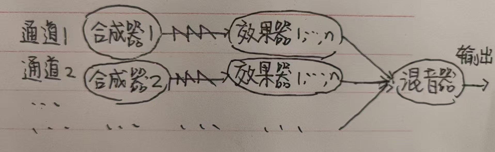
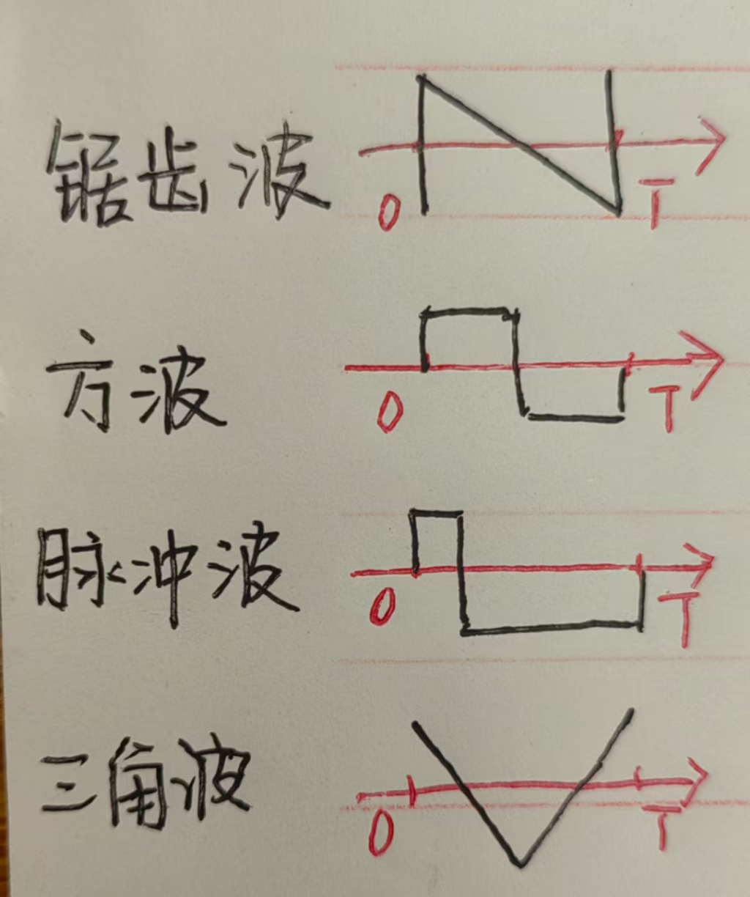

# 前置知识
#### wav文件
1. 声音是一个振动过程，.wav文件把每个时刻振动的状态**采样**并记录为一个数，形成一个数组。采样的频率是**采样率 sample_rate**，为44100次/秒。
2. .wav文件将左右声道的数据交替排列
3. byte_studio每次播放歌曲时需要先生成整首歌的.wav文件，再播放
4. byte_studio用于制作8bit音乐，这样的音乐采样得到的是**8bit整数**，范围是[-127,128]。8bit=1byte，软件由此得名。

#### 发声原理
音乐由很多**通道/音轨**构成，声音的处理流程如下：
**合成器 synthesiser**发出声音——>**效果器 effecter**修饰声音——>**混音器 mixer**将不同轨道的声音混合

- 一条通道中有一个合成器，可以有多个效果器   
- 合成器也能内置效果器

##### 合成器
1. 合成器按一定的频率重复特定的波形，生成乐音
2. 合成器通过这次采样的时间计算出当前的**相位**。相位是合成器在波形中取样的位置。具体来说，每个合成器有一个相位时钟，每次需要采样时，将时钟加上**frequency/sample_rate**再**对2取余**得到当前的相位（数学证明略）
3. 合成器根据相位，结合波形算出当前时刻的振动状态，已经实现的五种波形是：**锯齿波 saw**、**方波square**、**脉冲波 spike**、**三角波 triangle**、**噪波 noise**，波形如下（噪波是随机生成的）：

##### 效果器
效果器部分种类如下：
1. **延迟/回声 delay**：声音按照一定的频率出现并不断衰减
2. **混响 reverb**：声音反复反射，听不出每次反射的声音，但是得到模糊的效果
3. **失真 distortion**：对声音进行某种处理，为声音增加新的谐波成分，让它听起来更有力量等。这些处理可能是可能是削波，纵向拉伸，欠采样等等
4. **fm调制 fm modulate**：音高按照正弦波变化，能避免旋律呆板
5. **立体声增强 stereo enhancer**：人耳因为**左右耳听到的声音有细微差别**感受到立体声（就像立体视觉）。byte_studio通过将左右声道的略微错位来增强立体声，错位程度越高，声音听起来越宽
6. **滤波器 Filter**：滤掉音频某一频段的声音

效果器可以理解为一个**函数**，它不产生声音，以当前的声音以及合成器参数作为因变量，以处理后的声音作为自变量

目前的效果器变量依然在合成器参数`SynthesiserParameters`结构体中，用`has_[name of effecter]`的格式的bool变量保存是否触发效果器，若触发，则用`[name of effecter]Parameters`中的参数处理声音

#####　混音器
混音器的工作很简单，直接将各轨音频相加即可

##### 编曲
使用者通过在某些时刻对软件发送**midi信号**实现编曲。midi信号告诉音符什么时候响起，什么时候停止，音高和音色是多少……等等

所有信号都带有两种信息，第一种是**音符独有的**，包括音高，声相（声音在左边还是右边），另一种是**整个通道共有的**，例如音色等合成器参数

但是控制每个信号对编曲者来说太复杂了，目前通过处理字符串得到正确的信号

# TODO
## 前端
#### 编曲
1. 基于目前的midi信号接口，采用交互友好的钢琴窗，功能支持
- 点击空白处绘制音符，点击音符删除之
- 拖动音符改变长度
- 框选音符移动、复制和删除

#### 音频文件分析和可视化
1. 波形可视化
每隔一小段时间，将当前播放的波形显示出来
2. 查看频谱

## 后端
#### 模式 pattern
1. 模式中的一系列音符可以移动到不同的位置，也便于复制相同的音符
2. 模式中有琶音器

#### 合成器
1. 更多波形类型（例如自定义波形）
  - 在 `wave_generator` 函数中添加新的波形生成逻辑。
  - 修改 `Channel` 结构体以支持新的波形类型。
2. 目前实现了基本的复音

#### 采样
1. 采样音频：在歌曲中播放一段录好的音频
2. 采样波形：可以截取wav文件的一部分波形，放在合成其中

#### 效果器
- 目前只实现了fm调制
- 在 `synth` 函数输出的通道中加入
1. 失真
2. 延迟
3. 混响
4. 立体声增强
5. 滤波

#### 通道/音轨
1. 通道输出功能增强
2. 通道能加入/删除效果器并调整效果器顺序
3. 每个通道可以处理该音轨的音量、声相

#### 参数输入
1.  参数独立
将决定一首歌的所有参数独立于程序，储存到单独的文件中，目前的参数都在文件中
2.  音频文件版本控制
每隔固定时间备份音频文件，备份总量有限制
3. 参数随时间变化

#### 音频输出
1. 实时音频预览
  - 创建一个实时音频播放模块。
  - 在音频生成过程中直接将音频数据发送到播放模块。
2. 音频文件格式转换
  - 支持其他音频格式，如 MP3、OGG 等。
  - 添加一个音频格式转换模块，使用音频编码库（如 `hound`、`libogg`）实现音频格式转换。
3. 音频文件元数据编辑
  - 用户可以在导出的音频中添加标题、作者、专辑等信息。
  - 添加一个元数据编辑模块，使用音频元数据编辑库（如 `metaflac`）
4. 可以选择不同的渲染位宽，默认8bit

